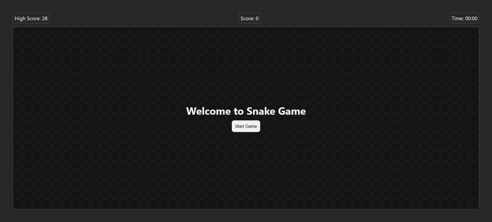
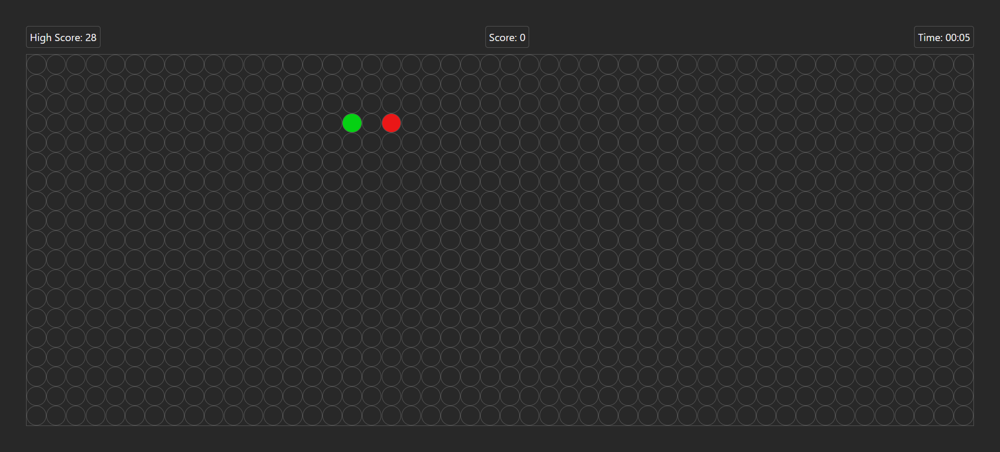
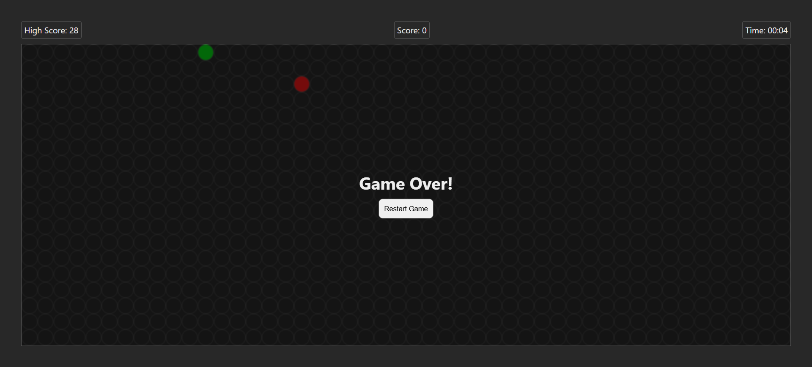

# 🐍 Snake Game (JavaScript)

A modern implementation of the classic Snake Game built using **HTML, CSS, and Vanilla JavaScript**. Control the snake, eat food, grow longer, and avoid collisions to achieve the highest score!

---

## 🎮 Features

* Smooth snake movement using keyboard controls
* Random food generation 🍎
* Score and High Score tracking (saved in browser storage)
* Live timer ⏱️
* Increasing difficulty (speed increases as score grows)
* Game Over and Restart functionality
* Clean UI with modal screens

---

## 🖥️ Preview

*(Add a screenshot or GIF here if you want — recommended!)*




---

## 🚀 Getting Started

### 📁 Project Structure

```
snake-game/
│
├── index.html     # Game layout and structure
├── style.css      # Styling and UI design
├── script.js      # Game logic
└── README.md
```

---

### ▶️ Run the Game

No installation required!

1. Download or clone the repository
2. Open the `index.html` file in your browser

```bash
git clone https://github.com/your-username/snake-game.git
cd snake-game
```

Then simply double-click `index.html` or open it in a browser.

---

## 🎯 Controls

| Key | Action     |
| --- | ---------- |
| ↑   | Move Up    |
| ↓   | Move Down  |
| ←   | Move Left  |
| →   | Move Right |

---

## 🧠 How It Works

* The game board is created dynamically using a grid system.
* The snake is represented as an array of coordinates.
* Food is randomly generated at positions that do not overlap the snake.
* Each game loop:

  * Updates snake position
  * Checks collisions (wall or self)
  * Checks food consumption
* Speed increases every 5 points for added difficulty.
* High score is stored using `localStorage`.

Implementation reference: 

---

## 📊 Game Mechanics

* Initial speed: **400ms per move**
* Speed increases every **5 points**
* Timer updates every **1 second**
* Game ends when:

  * Snake hits wall ❌
  * Snake collides with itself ❌

---

## ✨ Future Improvements

* Add sound effects 🔊
* Add pause/resume feature ⏸️
* Mobile touch controls 📱
* Difficulty selection 🎚️
* Save game state 💾

---

## 🛠️ Technologies Used

* HTML5
* CSS3 (Flexbox & Grid)
* JavaScript (DOM Manipulation & Game Logic)

---

## 🤝 Contributing

Contributions are welcome!

1. Fork the repository
2. Create a new branch
3. Make your changes
4. Submit a pull request

---

## 📄 License

This project is licensed under the MIT License.

---

## 🙌 Acknowledgements

* Inspired by the classic Snake game from old mobile phones
* Built as a fun project to practice JavaScript and DOM manipulation

---

## ⭐ Support

If you like this project, consider giving it a ⭐ on GitHub!
